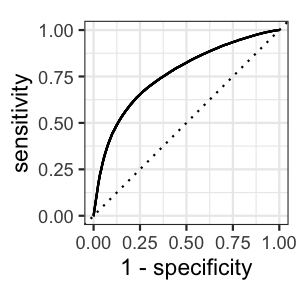
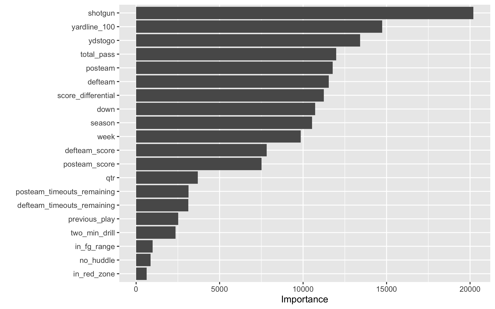
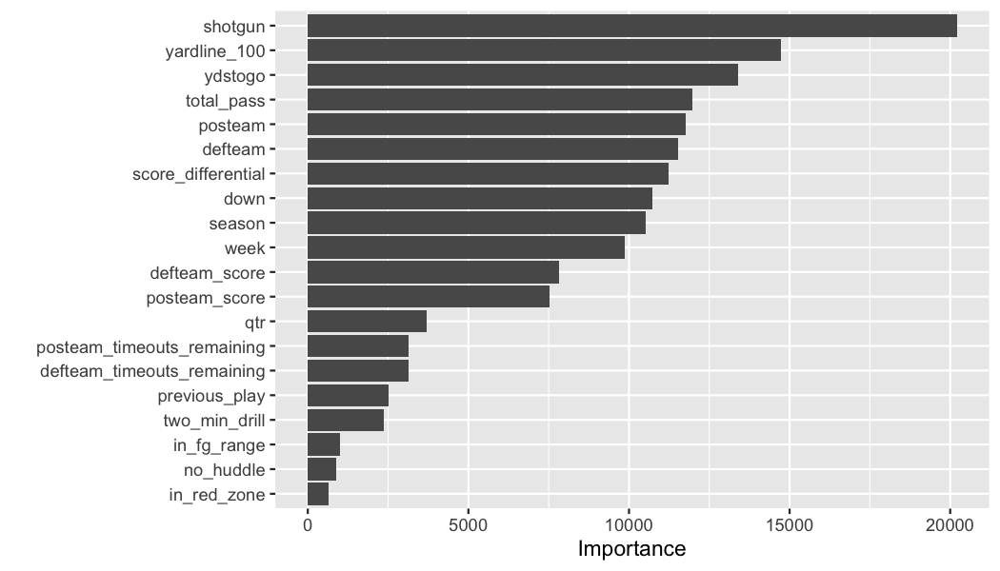

```{r setup, include = FALSE, eval = TRUE}
library(tidyverse)
library(tidymodels)
library(xaringan)

knitr::opts_chunk$set(eval = FALSE)
```


```{r xaringan-themer, eval = TRUE, include=FALSE, warning=FALSE}
library(xaringanthemer)
style_mono_light(
  base_color = "#374785",
  text_color = darken_color("#8E8D8A", 0.5),
  white_color = lighten_color("#C2CAD0", 0.95),
  code_inline_color = choose_dark_or_light("#E98074", "#E85A4F"),
  header_font_google = google_font("Noto Sans"),
  text_font_google   = google_font("Karla", "300", "300i"),
  code_font_google   = google_font("Fira Mono"),
  extra_css = list(".hljs-github .hjls" = list("background" = "black"),
                   ".small" = list("font-size" = "70%"),
                   ".small pre .remark-code" = list("font-size" = "75%"),
                   ".small .remark-code" = list("font-size" = "75%"),
                   ".tiny .remark-code" = list("font-size" = "50%"),
                   ".medium .remark-code" = list("font-size" = "90%")
  )
)
```

```{css, include = FALSE, eval = TRUE}
/* Extra CSS */
.hljs-github .hjls {
  background: black;
}
.small {
  font-size: 70%;
}
.small pre .remark-code {
  font-size: 75%;
}
.small .remark-code {
  font-size: 80%;
}
.tiny .remark-code {
  font-size: 60%;
}
.medium .remark-code {
  font-size: 90%;
}

```

### Personas

* You're interested in fitting models in R with NFL data
* You've done some modeling
* You're new to `tidymodels`
* You're awesome because you came to HANIC!

### Slide Link: [`jthomasmock.github.io/nfl_hanic/`](https://jthomasmock.github.io/nfl_hanic/)

### Repo w/ Code: [github.com/jthomasmock/nfl_hanic](https://github.com/jthomasmock/nfl_hanic)

---

# `tidymodels`

The `tidymodels` framework is a collection of packages for modeling and machine learning using `tidyverse` principles.

## Packages
* `rsample`: efficient data splitting and resampling
* `parsnip`: tidy, unified interface to models
* `recipes`: tidy interface to data pre-processing tools for feature engineering
* `workflows`: bundles your pre-processing, modeling, and post-processing
* `tune`: helps optimize the hyperparameters and pre-processing steps
* `yardstick`: measures the performance metrics
* `broom`: converts common R statistical objects into predictable formats
* `dials`: creates and manages tuning parameters/grids

---

# Learn more

* [`tidymodels`.org](https://www.tidymodels.org/learn/) has step by step guides of various complexities

* I'll be adding additional NFL-focused examples at: [TheMockup.blog](https://themockup.blog/posts/2020-05-01-tidy-long-models/)

* Julia Silge's (a `tidymodels` maintainer) [blog](https://juliasilge.com/) or [video series](https://www.youtube.com/channel/UCTTBgWyJl2HrrhQOOc710kA)

* Alison Hill's [Workshop from rstudio::conf2020](https://conf20-intro-ml.netlify.app/)

* Gentle Intro to `tidymodels` on [RStudio RViews blog](https://rviews.rstudio.com/2019/06/19/a-gentle-intro-to-tidymodels/)

---


## Before we get started, thank you to:

.pull-left[
### The `nflscrapR` team:
(data from 2009-current)
* Maksim Horowitz
* Ron Yurko
* Sam Ventura
* Rishav Dutta

### The `nflfastR` team:
(data from 2000-current)
* Ben Baldwin
* Sebastian Carl
]

.pull-right[
```{r, eval = TRUE, out.width = "50%", echo = FALSE}
knitr::include_graphics("https://pbs.twimg.com/profile_images/1076883081192263680/hj53KzOl_400x400.jpg")
```
<br>

```{r, eval = TRUE, out.width = "50%", echo = FALSE}
knitr::include_graphics("https://raw.githubusercontent.com/mrcaseb/nflfastR/master/man/figures/logo.png")
```

]

These datasets set the bar for publicly-available NFL data!

---

### The Dataset

Filtered down from the `nflscrapR` and `nflfastR` datasets (~2.25 GB) to only non-penalty run and pass plays from 2000 and 2019. This is about 15 million data points across ~630 thousand plays.

.small[
```{r, size=1}
# Rows: 628,602
# Columns: 25
# $ play_type                  <fct> run, pass, pass, run, run, run, pass, pass, pass, run, pass,…
# $ yards_gained               <dbl> 2, 0, 0, 8, 3, -1, 15, 11, 0, 3, 0, -1, 5, 7, 0, -1, 13, 1, …
# $ season                     <fct> 2000, 2000, 2000, 2000, 2000, 2000, 2000, 2000, 2000, 2000, …
# $ ydstogo                    <dbl> 10, 8, 8, 10, 2, 10, 11, 10, 10, 10, 7, 10, 11, 6, 10, 10, 1…
# $ posteam                    <fct> ARI, ARI, ARI, NYG, NYG, NYG, NYG, NYG, NYG, NYG, NYG, ARI, …
# $ posteam_score              <dbl> 0, 0, 0, 0, 0, 0, 0, 0, 0, 0, 0, 0, 0, 0, 0, 0, 0, 0, 0, 0, …
# $ defteam                    <fct> NYG, NYG, NYG, ARI, ARI, ARI, ARI, ARI, ARI, ARI, ARI, NYG, …
# $ shotgun                    <fct> 0, 0, 1, 0, 0, 0, 0, 0, 0, 0, 0, 0, 0, 1, 0, 0, 1, 0, 0, 0, …
# $ game_id                    <dbl> 2000090300, 2000090300, 2000090300, 2000090300, 2000090300, …
# $ game_date                  <dbl> 11203, 11203, 11203, 11203, 11203, 11203, 11203, 11203, 1120…
# $ game_seconds_remaining     <dbl> 3600, 3544, 3537, 3520, 3520, 3520, 3520, 3520, 3359, 3359, …
# $ down                       <fct> 1, 2, 3, 1, 2, 1, 2, 1, 1, 2, 3, 1, 2, 3, 1, 2, 3, 1, 2, 3, …
# $ yardline_100               <dbl> 65, 63, 63, 78, 70, 67, 68, 53, 42, 42, 39, 94, 95, 90, 83, …
# $ qtr                        <fct> 1, 1, 1, 1, 1, 1, 1, 1, 1, 1, 1, 1, 1, 1, 1, 1, 1, 1, 1, 1, …
# $ no_huddle                  <fct> 0, 0, 0, 0, 0, 0, 0, 0, 0, 0, 0, 0, 0, 0, 0, 0, 0, 0, 0, 0, …
# $ posteam_timeouts_remaining <fct> 3, 3, 3, 3, 3, 3, 3, 3, 3, 3, 3, 3, 3, 3, 3, 3, 3, 3, 3, 3, …
# $ defteam_timeouts_remaining <fct> 3, 3, 3, 3, 3, 3, 3, 3, 3, 3, 3, 3, 3, 3, 3, 3, 3, 3, 3, 3, …
# $ score_differential         <dbl> 0, 0, 0, 0, 0, 0, 0, 0, 0, 0, 0, 0, 0, 0, 0, 0, 0, 0, 0, 0, …
# $ defteam_score              <dbl> 0, 0, 0, 0, 0, 0, 0, 0, 0, 0, 0, 0, 0, 0, 0, 0, 0, 0, 0, 0, …
# $ week                       <dbl> 1, 1, 1, 1, 1, 1, 1, 1, 1, 1, 1, 1, 1, 1, 1, 1, 1, 1, 1, 1, …
# $ in_red_zone                <fct> 0, 0, 0, 0, 0, 0, 0, 0, 0, 0, 0, 0, 0, 0, 0, 0, 0, 0, 0, 0, …
# $ in_fg_range                <fct> 0, 0, 0, 0, 0, 0, 0, 0, 0, 0, 0, 0, 0, 0, 0, 0, 0, 0, 0, 0, …
# $ total_runs                 <dbl> 0, 1, 1, 0, 1, 2, 3, 3, 3, 3, 4, 1, 2, 2, 3, 3, 4, 4, 5, 6, …
# $ total_pass                 <dbl> 0, 0, 1, 0, 0, 0, 0, 1, 2, 3, 3, 2, 2, 3, 3, 4, 4, 5, 5, 5, …
# $ previous_play              <fct> First play of Drive, run, pass, First play of Drive, run, ru…
```

]

---

### Data Prep

I don't want to get lost in the weeds on data prep or feature engineering, but for future reference here are the `filter` and `mutate` steps I applied. I also use `dbplyr` to pull the data in so that I could work with the 2.2 GB of data on disk and only pull into memory the specific rows/columns I wanted to work with. Full details about `dbplyr` + `nflfastR` data on my [blog](https://themockup.blog/posts/2019-04-28-nflfastr-dbplyr-rsqlite/).

.small[
```{r, eval = FALSE}
pbp_db <- tbl(DBI::dbConnect(RSQLite::SQLite(), "data/pbp_db.sqlite"), "pbp_clean_2000-2019")


raw_plays <- pbp_db %>% 
  select(game_id, game_date, game_seconds_remaining, season_type, week,season,
         play_type, yards_gained, ydstogo, down, yardline_100, qtr, posteam, posteam_score, defteam, 
         defteam_score,score_differential, shotgun,  no_huddle, 
         posteam_timeouts_remaining, defteam_timeouts_remaining, penalty) %>% 
  filter(play_type %in% c("run", "pass"), 
         penalty == 0,
         season_type == "REG", 
         !is.na(down),
         !is.na(yardline_100))%>% 
  mutate(in_red_zone = if_else(yardline_100 <= 20, 1, 0),
         in_fg_range = if_else(yardline_100 <= 35, 1, 0),
         run = if_else(play_type == "run", 1, 0),
         pass = if_else(play_type == "pass", 1, 0))
```
]
---

### Feature Engineering

I added a few features, namely a running total of number of runs/passes pre-snap and what the previous play was.

.small[
```{r,eval = FALSE}
add_previous_play <- raw_plays %>%
  group_by(game_id, posteam) %>%
  mutate(
    total_runs = if_else(play_type == "run",
      cumsum(run) - 1, cumsum(run)
    ),
    total_pass = if_else(play_type == "pass",
      cumsum(pass) - 1, cumsum(pass)
    ),
    previous_play = if_else(posteam == lag(posteam),
      lag(play_type), "First play of Drive"
    ),
    previous_play = if_else(is.na(previous_play),
      replace_na("First play of Drive"), previous_play
    )
  ) %>%
  select(-run, -pass, -penalty, -season_type) %>%
  ungroup() %>%
  collect()

all_plays <- raw_plays %>% 
  mutate_at(vars(
    play_type, season, posteam, defteam, shotgun, down, qtr, no_huddle,
    posteam_timeouts_remaining, defteam_timeouts_remaining, in_red_zone,
    in_fg_range, previous_play
), as.factor)
```

]
---

## Data Splitting w/ `rsample`

Now that I've created the dataset to use, I'll start with `tidymodels` proper.

Do the initial split and stratify by play type (make sure there are equal ratios of run vs pass in `test` and `train`)
```{r, eval = FALSE}
split_pbp <- initial_split(all_plays, 0.75, strata = play_type)

split_pbp

# separate the training data
train_data <- training(split_pbp)

# separate the testing data
test_data <- testing(split_pbp)
```

---

### Test vs Train

Split into `training` and `testing` and then confirm the ratios.
.medium[
```{r split and train ratio}
train_data %>% 
  count(play_type) %>% 
  mutate(ratio = n/sum(n))
```

```{r output train ratio}
# A tibble: 2 x 3
#   play_type      n ratio
#   <fct>      <int> <dbl>
# 1 pass      270979 0.575
# 2 run       200473 0.425
```


```{r print test ratio}
test_data %>% 
  count(play_type) %>% 
  mutate(ratio = n/sum(n))
```

```{r output test ratio}
# A tibble: 2 x 3
#   play_type     n ratio
#   <fct>     <int> <dbl>
# 1 pass      90326 0.575
# 2 run       66824 0.425
```

]
---

## Add recipe steps with `recipes`

`recipe` steps are changes we make to the dataset, including things like centering, dummy encoding, update columns as ID only, or even custom feature engineering. 


```{r, eval = FALSE}
pbp_rec <- recipe(play_type ~ ., data = train_data) %>% 
  # ignore these vars for train/test, but include in data as ID
  update_role(game_id, game_date, yards_gained, new_role = "ID") %>% 
   # removes vars that have large absolute correlations w/ other vars
  step_corr(all_numeric(), threshold = 0.7) %>% 
  step_center(all_numeric()) %>%  # substract mean from numeric
  step_zv(all_predictors()) # remove zero-variance predictors
```

---

## Choose a model and start your engines!

`parsip` supplies a general modeling interface to the wide world of R models!


```{r}
lr_mod <- logistic_reg(mode = "classification") %>% 
  set_engine("glm")
```

---

## Combine into a `workflow`

We can now combine the model and recipe into a `workflow` - this allows us to define exactly what model and data are going into our `fit`/train call.

```{r}
lr_wflow <- workflow() %>% 
  add_model(lr_mod) %>% # parsnip model
  add_recipe(pbp_rec)   # recipe from recipes
```

### What is a `workflow`?

A workflow is an object that can bundle together your pre-processing, modeling, and post-processing requests. For example, if you have a `recipe` and `parsnip` model, these can be combined into a workflow. The advantages are:

* You don’t have to keep track of separate objects in your workspace.

* The recipe prepping and model fitting can be executed using a single call to `fit()`.

* If you have custom tuning parameter settings, these can be defined using a simpler interface when combined with `tune`.

---

## Fit/train the model with `parsnip`

Now we can move forward with fitting/training the model - this is really a one-liner.

```{r}
pbp_fit_lr <- lr_wflow %>% 
  fit(data = train_data) # fit the model against the training data
```


---

## Predict outcomes with `parsnip`

After the model has been trained we can compare the training data against the holdout testing data.

```{r}
pbp_pred_lr <- predict(pbp_fit_lr, test_data) %>% 
  # Get probabilities for the class for each observation
  bind_cols(predict(pbp_fit_lr, test_data, type = "prob")) %>% 
  # Add back a "truth" column for what the actual play_type was
  bind_cols(test_data %>% select(play_type)) 
```

---

### Check outcomes with `yardstick`

For confirming how well the model predicts, we can use `yardstick` to plot ROC curves, get AUC and collect general metrics.
.pull-left[
.small[
```{r}
pbp_pred_lr %>% 
  # get Area under Curve
  roc_auc(truth = play_type, 
          .pred_pass)

pbp_pred_lr %>% 
  # collect and report metrics
  metrics(truth = play_type, 
          .pred_class)
```

```{r}
# A tibble: 1 x 3
#   .metric .estimator .estimate
#   <chr>   <chr>          <dbl>
# 1 roc_auc binary         0.761

# A tibble: 2 x 3
#   .metric  .estimator .estimate
#   <chr>    <chr>          <dbl>
# 1 accuracy binary         0.698
# 2 kap      binary         0.384
```
]

]

  
.small[
```{r}
pbp_pred_lr %>% 
  # calculate ROC curve
  roc_curve(truth = play_type, 
            .pred_pass) %>% 
  # ggplot2 autoplot for AB line 
  # and the path of ROC curve
  autoplot()

```

]




---

#### All together!

.small[
```{r}
# Split
split_pbp <- initial_split(all_plays, 0.75, strata = play_type)

# Split into test/train
train_data <- training(split_pbp)
test_data <- testing(split_pbp)
```

```{r}
# Create a pre-processing recipe
pbp_rec <- recipe(play_type ~ ., data = train_data) %>% 
  update_role(game_id, game_date, yards_gained, new_role = "ID")

# Choose a model and an engine
lr_mod <- logistic_reg(mode = "classification") %>% 
  set_engine("glm")
```


```{r}
# Combine the mode and recipe to the workflow
lr_wflow <- workflow() %>% 
  add_model(lr_mod) %>% 
  add_recipe(pbp_rec)
           
# Fit/train the model
pbp_fit_lr <- lr_wflow %>% 
  fit(data = train_data)
```

```{r}
# Get predictions
pbp_pred_lr <- predict(pbp_fit_lr, test_data) %>% 
  bind_cols(predict(pbp_fit_lr, test_data, type = "prob")) %>% 
  bind_cols(test_data %>% select(play_type)) 

# Check metrics
pbp_pred_lr %>% 
  metrics(truth = play_type, .pred_class)
```

]

---

## Change the model

How about a Random Forest model?

```{r}
rf_mod <- rand_forest(trees = 1000) %>% 
  set_engine("ranger", 
             # This lets us do variable importance later
             importance = "impurity", 
             # Parallelization of the model
             num.threads = 4) %>% 
  set_mode("classification")

rf_wflow <- workflow() %>% 
  add_model(rf_mod) %>%  # New model
  add_recipe(pbp_rec) # Same recipe

pbp_fit_rf <- rf_wflow %>% 
  fit(data = train_data)

pbp_pred_rf <- predict(pbp_fit_rf, test_data) %>% 
  bind_cols(test_data %>% select(play_type, down, ydstogo)) %>% 
  bind_cols(predict(pbp_fit_rf, test_data, type = "prob"))
```


---

### Quick comparison

The random forest model slightly outperforms the logistic regression, although both are fairly `meh`

```{r compare_metrics call}
pbp_pred_rf %>% 
  metrics(truth = play_type, .pred_class)

pbp_pred_lr %>% 
  metrics(truth = play_type, .pred_class)
```

```{r compare metrics print}
# A tibble: 2 x 3
#   .metric  .estimator .estimate
#   <chr>    <chr>          <dbl>
# 1 accuracy binary         0.722
# 2 kap      binary         0.433
# 
# # A tibble: 2 x 3
#   .metric  .estimator .estimate
#   <chr>    <chr>          <dbl>
# 1 accuracy binary         0.700
# 2 kap      binary         0.388

```


---

### Feature Importance

.small[
```{r}
pbp_fit_rf %>%   
  pull_workflow_fit() %>% 
  vip(num_features = 20)
```

]



---

### Comparing Models Together

.small[
.pull-left[
```{r}
roc_rf <- pbp_pred_rf %>% 
  roc_curve(truth = play_type, .pred_pass) %>% 
  mutate(model = "Random Forest")

roc_lr <- pbp_pred_lr %>% 
  roc_curve(truth = play_type, .pred_pass) %>% 
  mutate(model = "Logistic Regression")

full_plot <- bind_rows(roc_rf, roc_lr) %>% 
  ggplot(aes(x = 1 - specificity, 
             y = sensitivity, 
             color = model)) + 
  geom_path(lwd = 1, alpha = 0.5) +
  geom_abline(lty = 3) + 
  scale_color_manual(values = c("#374785", "#E98074")) +
  theme(legend.position = "top")
  
full_plot
```

]

]

.pull-right[



]
